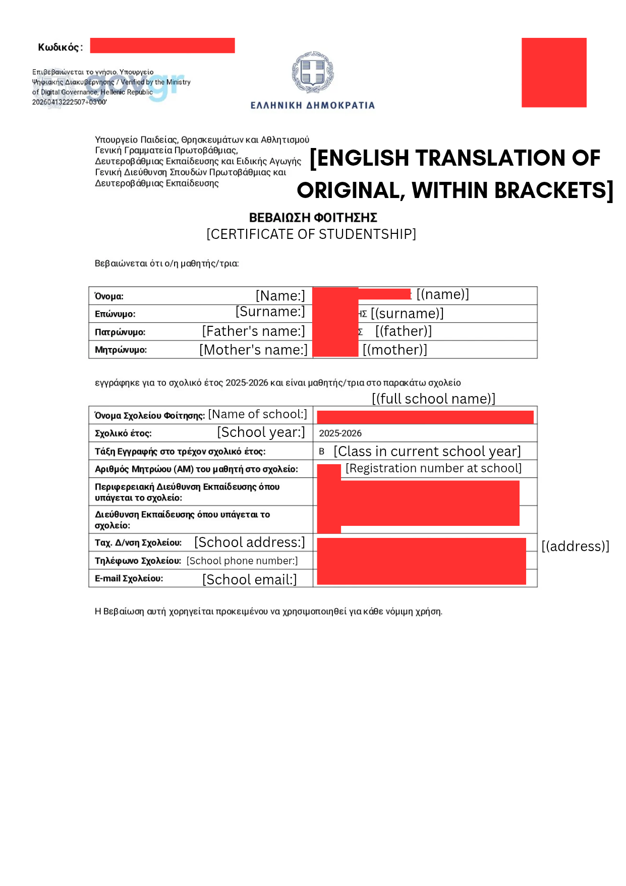
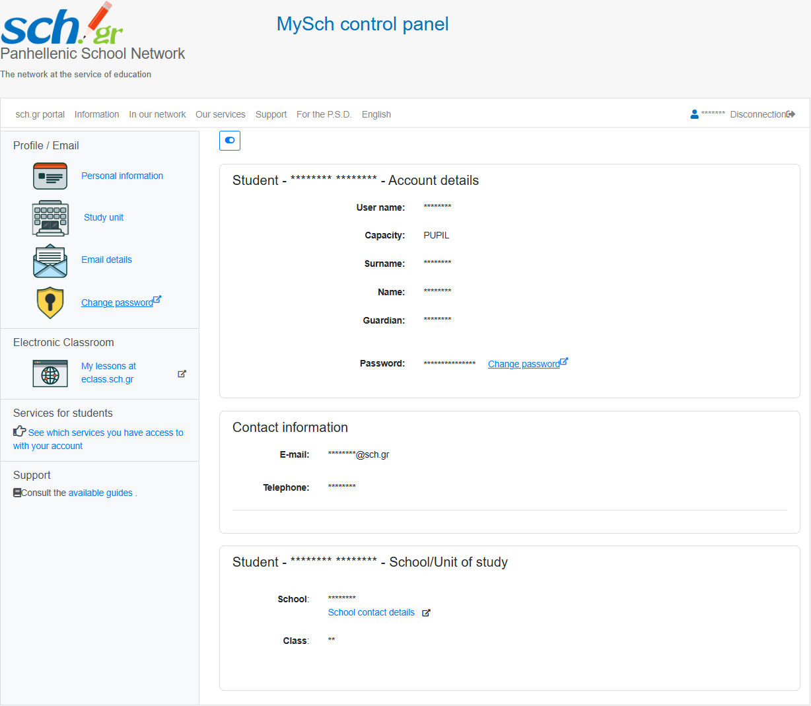

# Πώς Να Κάνετε Αίτηση στο GitHub Student Developer Pack, ως Μαθητές Δευτεροβάθμιας Εκπαίδευσης 

**Διάρκεια:** 15-30’

# Αλλά, γιατί να κάνω εγγραφή;

Το GitHub Student Developer Pack, προσφέρει πολλά και ποικίλα προνόμια στους μαθητές δευτεροβάθμιας και τριτοβάθμιας εκπαίδευσης, μερικά από τα οποία είναι:

* Δωρεάν GitHub Pro  
* Δωρεάν GitHub Copilot Student  
* Δωρεάν Pro level πρόσβαση στα GitHub Codespaces   
* Δωρεάν 1 χρόνος Microsoft 365 \+ 1TB αποθηκευτικό χώρο στο OneDrive  
* Δωρεάν πρόσβαση στις υπηρεσίες του Microsoft Azure: App Services, Azure Functions, Notification Hubs, MySQL database from MySQL in-app, Application Insights, Azure DevOps.  
* Δωρεάν η πιστοποίηση GitHub Fundamentals (GH-900)   
* Δωρεάν το 1ο έτος χρήσης domain με καταλήξεις .tech, .me, .live, .studio, .software, .app, .dev, κ.α.  
* Δωρεάν πρόσβαση στα JetBrains IDEs  
* Δωρεάν πρόσβαση στο Notion Education με επιπρόσθετες δυνατότητες AI   
* Δωρεάν 3 μήνες πρόσβαση στο Boot.dev, και 6 μήνες πρόσβαση στο Codédex  
* Δωρεάν 6 μήνες πρόσβαση στο Arduino Cloud, και εκπτώσεις σε επιλεγμένο εξοπλισμό Arduino και Adafruit

Και πολλά άλλα, διαθέσιμα στο [https://education.github.com/pack](https://education.github.com/pack). 

# Προαπαιτούμενα

- [ ] Πρόσβαση σε υπολογιστή με διαδίκτυο   
- [ ] Πρόσβαση σε κινητό (ή φωτογραφική μηχανή)  
- [ ] Πρόσβαση σε εκτυπωτή (για εκτύπωση 3 σελίδων)

# Στάδιο Ι: Στο GitHub:

1. Δημιουργήστε λογαριασμό στο GitHub, στο [https://github.com/signup](https://github.com/signup), χρησιμοποιώντας προσωπικό σας email (θα προσθέσουμε του sch.gr αργότερα \- το σημαντικό είναι, ανεξάρτητα από την ακαδημαϊκή σας ταυτότητα, να έχετε πρόσβαση στο GitHub σας)  
2. Πατήστε πάνω στην εικόνα προφίλ σας, πατήστε **⚙️ Settings**, και μετά 👤 **Public Profile**  
3. Στο πεδίο **Name**, συμπληρώστε το ονοματεπώνυμο σας με λατινικούς χαρακτήρες, όπως ακριβώς εμφανίζεται στην ταυτότητα σας, και πατήστε **Save**  
4. Πατήστε 💳 **Billing and Licensing** → **Payment Information**  
5. Κάτω από το πλαίσιο **Billing Information**, συμπληρώστε όλα σας τα προσωπικά στοιχεία, με λατινικούς χαρακτήρες, όπως εμφανίζεται στην ταυτότητα σας. *(Ονοματεπώνυμο, Διεύθυνση, Πόλη, Χώρα, Δήμος, Ταχυδρομικός Κώδικας (χρησιμοποιούνται για να επαληθεύσει πως όντως μένετε στην ίδια γενικά περιοχή με το σχολείο σας \- το ΑΦΜ δεν είναι απαραίτητο))*, και πατήστε **Save billing information**. Δεν χρειάζεται να εισάγετε *μεθόδους* πληρωμής (χρεωστικές κάρτες κλπ), μόνο τα στοιχεία.  
6. Πατήστε ✉️ **Emails**  
7. Στο πεδίο Add email address, πληκτρολογήστε την διεύθυνση email σας ορισμένη από το Πανελλήνιο Σχολικό Δίκτυο (λήγει σε @[sch.gr](http://sch.gr)), πηγαίνετε στο inbox σας ([webmail.sch.gr](http://webmail.sch.gr)), και επαληθεύστε το email σας πατώντας στο link.  
8. Πατήστε 🛡️ **Password and Authentication**, και ενεργοποιήστε το Two-factor Authentication (2FA) πατώντας **Enable two-factor authentication**, και χρησιμοποιώντας ένα Authenticator App, έναν αριθμό κινητού, ή την εφαρμογή GitHub στο κινητό σας.

# Στάδιο ΙΙ: Χαρτούρα

1. **Εκδώστε Βεβαίωση Φοίτησης**   
   1. Εκδώστε, μέσω [https://www.gov.gr/ipiresies/ekpaideuse/eggraphe-se-skholeio/attending-school](https://www.gov.gr/ipiresies/ekpaideuse/eggraphe-se-skholeio/attending-school), μια **Βεβαίωση φοίτησης μαθητή/τριας σε σχολείο**, μέσω του προσωπικού σας Gov (αν έχετε δηλώσει τα προσωπικά σας στοιχεία στο ΕΜΕπ) ή ενός κηδεμόνα, κατεβάστε το σε .pdf, και εκτυπώστε το  
   2. Μετατρέψτε το .pdf σε .png, χρησιμοποιώντας ένα online εργαλείο μετατροπής, σαν αυτό: [https://cloudconvert.com/pdf-to-png](https://cloudconvert.com/pdf-to-png)   
   3. Ανεβάστε το αρχείο εικόνας σε ένα πρόγραμμα επεξεργασίας εικόνας, όπως το Canva, ή το Microsoft Paint  
   4. Μεταφράστε το έγγραφο στα Αγγλικά, προσθέτοντας πλαίσια κειμένου ΔΊΠΛΑ από αυτά του αρχικού (χωρίς να τροποποιήσετε τα αρχικά πεδια):  
      1. Σημειώστε στην κορυφή της σελίδας: “\[ENGLISH TRANSLATION OF ORIGINAL BETWEEN BRACKETS\]”  
      2. Σημειώστε κάτω από τον τίτλο ΒΕΒΑΙΩΣΗ ΣΠΟΥΔΩΝ: “\[CERTIFICATE OF STUDENTSHIP\]”  
      3. Μεταφράστε τα βασικά στοιχεία του εγγράφου στα Αγγλικά, με κάθε δική σας προσθήκη σε διαφορετική γραμματοσειρά από του αρχικού εγγράφου, και ανάμεσα σε αγκύλες  
      4. Το τελικό αποτέλεσμα θα πρέπει νά φαίνεται κάπως έτσι: (τα κόκκινα πλαίσια κρύβουν προσωπικές μου πληροφορίες \- στο δικό σας έγγραφο, πρέπει να είναι εκτεθειμένα)  
           
   5. Εκτυπώστε ΚΑΙ το μεταφρασμένο έγγραφο, και φυλάξτε το μαζί με το αρχικό, για το Στάδιο ΙΙΙ.  
2. **Δημιουργήστε “βεβαίωση” για το email του ΠΣΔ**  
   1. Το ΠΣΔ *δεν* εκδίδει επίσημες βεβαιώσεις για κατοχή email από χρήστη \- αλλά, για το GitHub, ένα screenshot του portal στο MySch, αρκεί κανονικότατα, μόνο που έχει πολλά περιττά στοιχεία (απλά πρέπει να μπείτε από υπολογιστή)  
   2. Πηγαίνετε στο [https://my.sch.gr/index.php](https://my.sch.gr/index.php), και κάντε Σύνδεση με τους κωδικούς ΠΣΔ σας.  
   3. Πατήστε F12 για να ανοίξετε το παράθυρο Inspect στην δεξιά πλευρά του περιηγητή   
   4. Στο παράθυρο Inspect που εμφανίστηκε, πάνω αριστερά, έχει ένα εικονίδιο (Select an element in the page to inspect it)  \- πατήστε το, επιλέξετε από την αριστερή πλευρά του περιηγητή ένα-ένα περιττό στοιχείο, και πατήστε Delete στο πληκτρολόγιο σας  
   5. Επαναλάβετε το πάνω βήμα, μέχρι να καταλήξει σε μια τέτοια μορφή:  
       
   6. Πατήστε πάνω-δεξιά στον περιηγητή σας το εικονίδιο, στην Μετάφραση Google, και μεταφράστε την σελίδα στα Αγγλικά   
   7. Χρησιμοποιήστε πάλι το εικονίδιο από το παράθυρο Inspect, τροποποιήστε οποιοδήποτε στοιχείο δεν ταυτίζεται ακριβώς με την πραγματική μετάφραση των στοιχείων στα Αγγλικά *(πχ. το όνομα Ιωάννης Πολίτης, μπορεί να μεταφραστεί λανθασμένα σε John Citizen \- διορθώσετε το ώστε να εμφανίζεται όπως είναι γραμμένο στην ταυτότητα)*  
   8. Πατήστε Ctrl \+ P, και εκτυπώστε την σελίδα  
3. Στοιχήστε τα τρία φύλλα (Βεβαίωση Φοίτησης στα Ελληνικά, Βεβαίωση Φοίτησης στα Αγγλικά, MySch) το ένα δίπλα στο άλλο, και τραβήξτε μια φωτογραφία από αυτά   
* *Σημείωση: Συνιστάται να εκτυπώσετε τα έγγραφα και να τα φωτογραφίσετε, αντί να υποβάλετε ψηφιακά αρχεία. Αν και η μετάφραση που προσθέσατε είναι σαφώς σημειωμένη ως τέτοια (με αγκύλες και διαφορετική γραμματοσειρά), τα ψηφιακά αρχεία που έχουν επεξεργαστεί σε πρόγραμμα όπως το Canva ενδέχεται να περιέχουν μεταδεδομένα που ενεργοποιούν αυτόματα φίλτρα κατά την υποβολή. Η εκτύπωση και φωτογράφηση εξαλείφει αυτή την περιττή μεταβλητή.* 

# Στάδιο ΙΙΙ: Δημιουργία Αίτησης 

1. Απενεργοποιήστε οποιοδήποτε VPN ή Ad-blocker που κρύβει την τοποθεσία σας. Πρέπει η IP σας να δείχνει ότι είστε στην Ελλάδα (και ιδανικά στην ίδια πόλη/περιοχή με το σχολείο)  
2. Μεταβείτε στο [https://github.com/settings/education/benefits](https://github.com/settings/education/benefits), και πατήστε **Start an application**.  
3. Συμπληρώστε την αίτηση   
   1. **Select your role in education:** Student  
   2. **What is the name of your school?** Ολογράφως το όνομα του σχολείου σας, όπως ακριβώς το μεταφράσατε και στην Βεβαίωση Φοίτησης και στο MySch παραπάνω  
   3. **What is your school email address?** Επιλέξτε την διεύθυνση email που λήγει σε @sch.gr.   
   4. Πατήστε **Share location** και αποδεχτείτε στον περιηγητή σας την πρόσβαση του GitHub στην τοποθεσία σας, πατώντας Αποδοχή στο σχετικό αναδυόμενο παράθυρο. Αν δεν μπορεί να εντοπίσει την τοποθεσία σας, ελέγξτε μήπως ο περιηγητής σας έχει απορρίψει αυτόματα την πρόσβαση, από το εικονίδιο  αριστερά της μπάρας αναζήτησης → Άδειες → Τοποθεσία   
   5. Πατήστε **Continue** (τα επόμενα πεδία μέχρι το επόμενο Continue μπορεί να μην εμφανιστούν, ανάλογα με το αν έχει ήδη καταχωρηθεί το σχολείο σας στο GitHub)  
   6. **What is your school’s website?** Συμπληρώστε την ιστοσελίδα του σχολείου σας αν έχει.  
   7. **What academic email does your school provide to teachers?** name@sch.gr  
   8. **What academic email does your school provide to students?** name@sch.gr  
   9. **How would you describe your school?** High school   
   10. **How many students are enrolled at your school?** Ανάλογα, συνήθως 100-500  
   11. **Street address,** Την διεύθυνση του σχολείου, με λατινικούς χαρακτήρες, όπως την μεταφράσατε στην Βεβαίωση Φοίτησης   
   12. **City, State, region or province** Την πόλη και τον Δήμο του σχολείου, με λατινικούς χαρακτήρες   
   13. Πατήστε **Continue**  
   14. **Please select the type of academic enrollment proof you would like to provide** 3\. Dated enrollment letter on school letterhead  
   15. Ανεβάστε την φωτογραφία από τα τρία έγγραφα. Αν το GitHub δεν σας αφήνει να κάνετε upload φωτογραφία και σας ανοίγει αναγκαστικά την κάμερα, ανοίξτε τη σελίδα της αίτησης από το κινητό, στοιχήστε πάλι τα τρία χαρτιά και βγάλτε τα φωτογραφία μέσα από τον browser.  
   16. Πατήστε **Submit** 

**Συγχαρητήρια\!** Μόλις υποβάλατε την αίτηση σας.   
Ελέγχετε περιοδικά την ιστοσελίδα [https://github.com/settings/education/benefits](https://github.com/settings/education/benefits), για να ενημερώνεστε για την κατάσταση της αίτησης σας. Η επεξεργασία της αίτησης σας μπορεί να διαρκέσει από 1 ώρα μέχρι και 1 μήνα, ενώ μετά την αποδοχή της, υπάρχει μια αναμονή 72 ωρών προτού μπορέσετε να χρησιμοποιήσετε τα προνόμια σας, ώστε να ενημερωθούν οι εταιρείες που προσφέρουν τα προνόμια αυτά. Το Pack κρατάει 1 χρόνο (μέχρι το τέλος της εκάστοτε σχολικής χρονιάς), μετά από τον οποίο, απαιτεί ανανέωση (ξεκινήστε από το Στάδιο ΙΙ). Θα ενημερωθείτε με email για την αποδοχή ή απόρριψη της αίτησης σας, και σε περίπτωση απόρριψης της, τις αιτίες για τις οποίες απορρίφθηκε, ώστε να ξαναυποβάλετε την αίτησή σας.